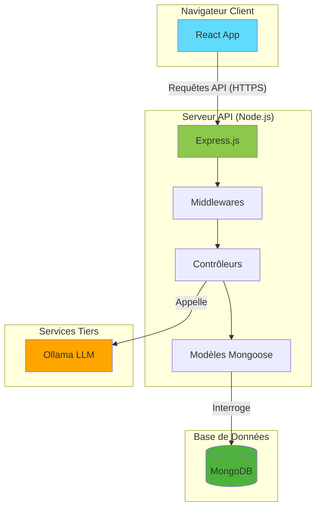
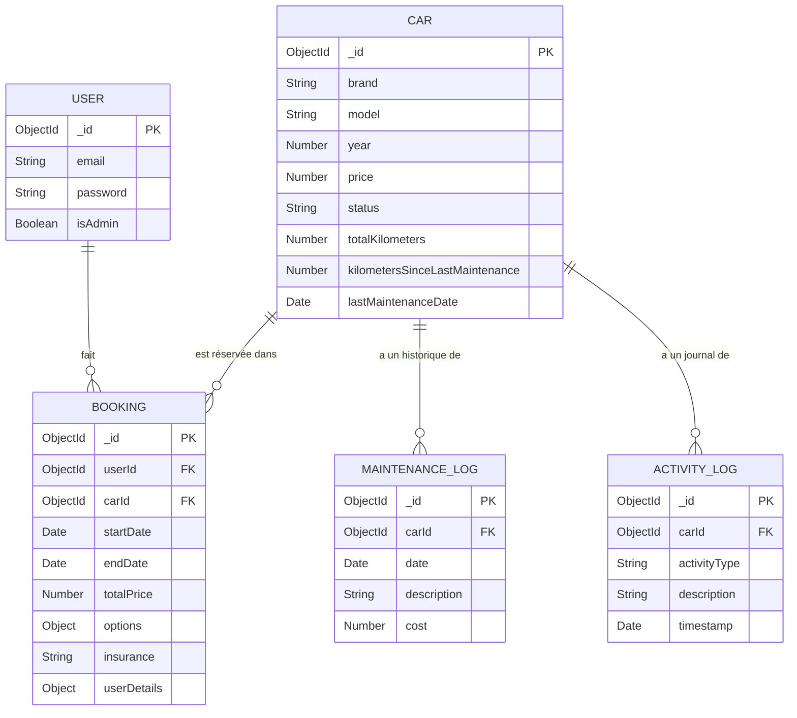

## Vue d'ensemble du Projet

Ce document fournit une analyse technique exhaustive de l'application **"Car Rental Management System"**.
L'objectif de ce projet était de développer une solution web complète et moderne pour la gestion d'une flotte de véhicules de location. La plateforme s'adresse à deux types d'utilisateurs : les **clients** (qui peuvent consulter et réserver des voitures) et les **administrateurs** (qui disposent d'outils puissants pour gérer l'ensemble du système).

L'architecture est scindée en deux projets distincts :

* **`car-rental-frontend`** : Une application client riche (Single-Page Application) développée en React.
* **`car-rental-backend-express`** : Une API RESTful robuste développée avec Express.js, servant de cerveau à l'application.

La philosophie de conception a privilégié la modularité, la maintenabilité et une expérience utilisateur claire et efficace.

---

## Architecture et Choix Technologiques

### Diagramme d'Architecture Globale

---

### Choix Technologiques et Justifications

#### **Frontend (`car-rental-frontend`)**

| Technologie      | Version    | Rôle et Justification                                                                        |
| ---------------- | ---------- | -------------------------------------------------------------------------------------------- |
| **React**        | `^18.2.0`  | Bibliothèque de référence pour la création d'interfaces utilisateur dynamiques et réactives. |
| **TypeScript**   | `^4.6.4`   | Ajoute un typage statique pour une meilleure robustesse et maintenabilité du code.           |
| **Vite**         | `^3.1.0`   | Outil de build ultra-rapide avec HMR performant.                                             |
| **shadcn/ui**    | `latest`   | Composants UI accessibles et esthétiques basés sur Radix UI et Tailwind CSS.                 |
| **Tailwind CSS** | `^3.3.3`   | Framework CSS utility-first pour un design rapide et cohérent.                               |
| **React Router** | `^6.16.0`  | Gestion de la navigation côté client.                                                        |
| **axios**        | `^1.13.2`  | Client HTTP pour la communication avec l'API backend.                                        |
| **Recharts**     | `latest`   | Visualisation de données dans le tableau de bord admin.                                      |
| **date-fns**     | `^4.1.0`   | Manipulation moderne et performante des dates.                                               |
| **Lucide React** | `^0.292.0` | Bibliothèque d'icônes claire et légère.                                                      |

---

#### **Backend (`car-rental-backend-express`)**

| Technologie    | Version  | Rôle et Justification                              |
| -------------- | -------- | -------------------------------------------------- |
| **Node.js**    | `LTS`    | Environnement d'exécution JavaScript côté serveur. |
| **Express.js** | `latest` | Framework minimaliste pour créer des API RESTful.  |
| **MongoDB**    | `Cloud`  | Base de données NoSQL orientée documents.          |
| **Mongoose**   | `latest` | ODM pour MongoDB avec validation et modélisation.  |
| **JWT**        | `latest` | Sécurisation des routes et gestion des sessions.   |
| **bcryptjs**   | `latest` | Hachage sécurisé des mots de passe.                |
| **Joi**        | `latest` | Validation des données entrantes des requêtes API. |
| **node-cron**  | `latest` | Planification de tâches récurrentes.               |
| **dotenv**     | `latest` | Gestion des variables d'environnement.             |

---

## Modèles de Données (Schémas Mongoose)

**Descriptions :**

* **User** : Utilisateur enregistré, avec gestion du rôle administrateur.
* **Car** : Véhicule de la flotte, avec suivi précis de l’état et du kilométrage.
* **Booking** : Réservation liant un utilisateur à une voiture sur une période donnée.
* **MaintenanceLog** : Historique des opérations de maintenance.
* **ActivityLog** : Journal des événements importants liés aux véhicules.

---

## Points d'API (Endpoints)

| Méthode  | Route                  | Description               | Accès       |
| -------- | ---------------------- | ------------------------- | ----------- |
| `POST`   | `/auth/register`       | Inscription utilisateur   | Public      |
| `POST`   | `/auth/login`          | Authentification + JWT    | Public      |
| `GET`    | `/cars`                | Voitures disponibles      | Public      |
| `GET`    | `/cars/:id`            | Détails d'une voiture     | Public      |
| `GET`    | `/cars/admin`          | Toutes les voitures       | Admin       |
| `POST`   | `/cars`                | Ajouter une voiture       | Admin       |
| `PUT`    | `/cars/:id`            | Mettre à jour une voiture | Admin       |
| `DELETE` | `/cars/:id`            | Supprimer une voiture     | Admin       |
| `PUT`    | `/cars/:id/status`     | Modifier le statut        | Admin       |
| `POST`   | `/bookings`            | Créer une réservation     | Utilisateur |
| `GET`    | `/bookings/admin`      | Toutes les réservations   | Admin       |
| `GET`    | `/users/admin`         | Liste des utilisateurs    | Admin       |
| `PUT`    | `/users/admin/:id`     | Modifier rôle admin       | Admin       |
| `POST`   | `/maintenance/:carId`  | Ajouter une maintenance   | Admin       |
| `GET`    | `/maintenance/:carId`  | Historique maintenance    | Admin       |
| `GET`    | `/dashboard/analytics` | Données analytiques       | Admin       |
| `POST`   | `/chatbot`             | Proxy vers Ollama         | Public      |

---

## Conclusion

Le projet **Car Rental Management System** est une application web robuste, moderne et extensible.
Son architecture modulaire, ses choix technologiques éprouvés et son orientation expérience utilisateur permettent une évolution simple et durable du système tout en répondant aux exigences fonctionnelles initiales.

